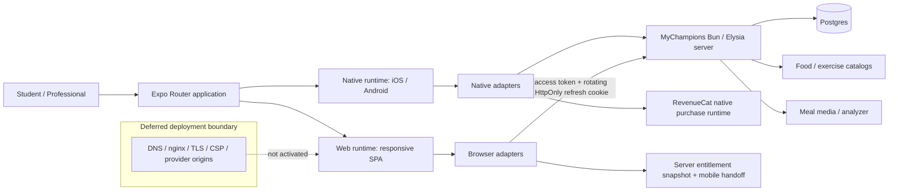

# Cross-Platform Stack (V1)

## Invariants

- Screens consume platform contracts; native SDK imports do not control browser access.
- Native bearer responses remain compatible while browser refresh tokens remain HttpOnly.
- Browser sign-out is a single-flight barrier: local identity clears immediately, while replacement authentication requests wait for the sign-out request to settle before establishing a new cookie session.
- The web build workflow exports an artifact only and has no publishing or infrastructure permissions.
