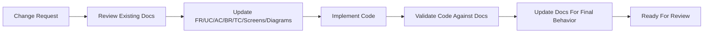

# Documentation Lifecycle

```mermaid
flowchart LR
  A[Change Request] --> B[Review Existing Docs]
  B --> C[Update FR/UC/AC/BR/TC/Screens/Diagrams]
  C --> D[Implement Code]
  D --> E[Validate Code Against Docs]
  E --> F[Update Docs For Final Behavior]
  F --> G[Ready For Review]
```

## Rule
No code change is complete until documentation reflects the final behavior.
