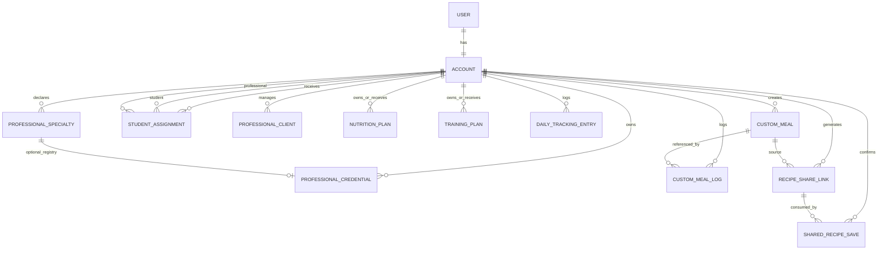

# Domain Relationships (Proposed)

## Notes
- Student and Professional are role profiles under account context.
- Specialty-specific assignment constraints apply to active relationships.
- Custom meals are account-owned and produce snapshot-based portion logs.
- Shared recipe saves create recipient-owned copies independent from source lifecycle.
- Shared-recipe import is idempotent per `(share_link, recipient_account)` and share-link payload is immutable nutrition snapshot data.
- `CUSTOM_MEAL` records use UUIDv7 primary identifiers for source and imported copies.
- Professional credentials are optional, scoped per specialty, and capped to one `professional_registry` record per specialty in MVP.
