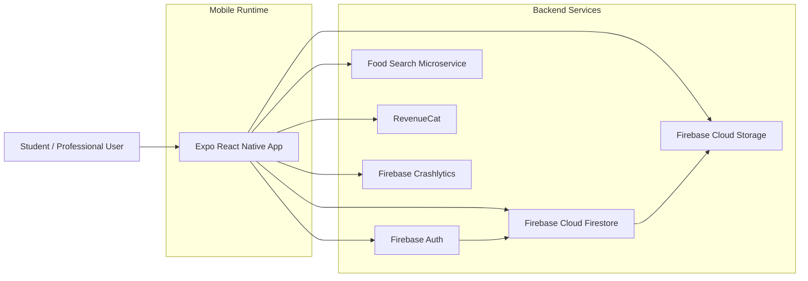

# Mobile Stack High-Level Diagram (V1)

```mermaid
flowchart LR
  U[Student / Professional User] --> A[Expo React Native App]

  A --> B[Firebase Auth]
  A --> C[Firebase Cloud Firestore]
  A --> D[Firebase Cloud Storage]
  A --> E[Food Search Microservice]
  A --> F[RevenueCat]
  A --> G[Firebase Crashlytics]

  B --> C
  C --> D

  subgraph Mobile Runtime
    A
  end

  subgraph Backend Services
    B
    C
    D
    E
    F
    G
  end
```

## Notes
- NFR baseline assumes no hard dependency on EAS for build/release.
- Native iOS and Android pipelines are owned in CI/CD with native toolchains.
