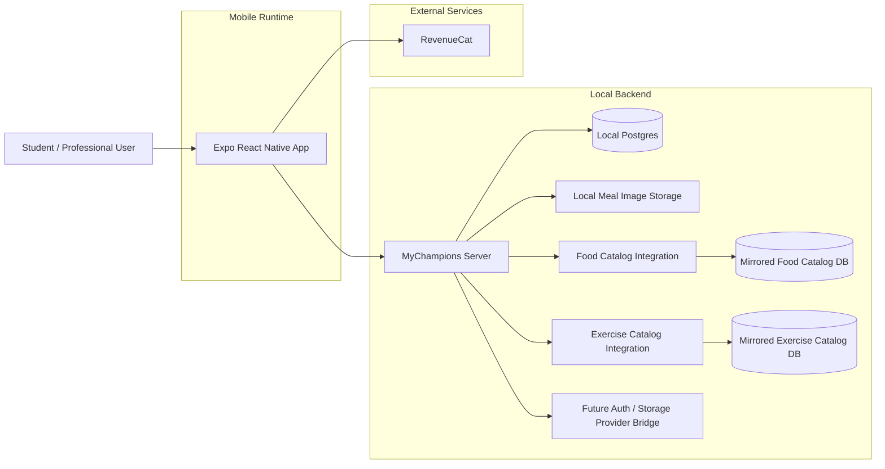

# Mobile Stack High-Level Diagram (V1)

## Notes

- The local MyChampions server is the active app-domain backend during the migration.
- Food and exercise catalog reads route through server endpoints backed by mirrored local catalog databases.
- Remote auth/storage provider wiring is future work; mobile source modules must not depend on a mobile-owned Firebase runtime path.
- NFR baseline assumes no hard dependency on EAS for build/release.
- Native iOS and Android pipelines are owned in CI/CD with native toolchains.
