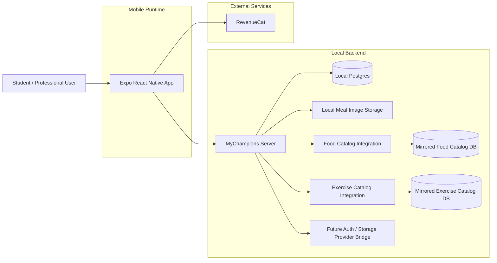

# Mobile Stack High-Level Diagram (V1)

> Historical mobile-focused view. The current Android/iOS/web architecture is documented in `cross-platform-stack-v1.md`.

## Notes

- The local MyChampions server is the active app-domain backend during the migration.
- Food and exercise catalog reads route through server endpoints backed by mirrored local catalog databases.
- Remote auth/storage provider wiring is future work; mobile source modules must not depend on a mobile-owned Firebase runtime path.
- NFR baseline assumes no hard dependency on EAS for build/release.
- Native iOS and Android pipelines are owned in CI/CD with native toolchains.
- PR CI resolves changed paths through feature ownership, declared dependencies,
  and reverse import consumers before executing focused Detox and Playwright
  suites. Shared-global or unknown runtime changes fail closed to the complete
  registered matrix. D-193 defines the candidate exact-head selective gate;
  D-195 blocks authoritative promotion until protected-`main`
  `pull_request_target` freshness invalidation, a GitHub-hosted-only PR preflight
  that observes that pending status, protected-`main` `workflow_run` execution through
  `trusted-selective-tests.yml`, GitHub-hosted triggering-run/live-PR
  authorization, read-only candidate/self-hosted tokens, trusted GitHub-hosted
  globally queued freshness/run-owned pending/final status publishing with
  unique owner/upstream PR binding and stale-run protection, repository policy,
  pinned dependencies, exact backend SHA, interruptible supervised native child
  groups, cancellation-safe durable device ownership, bounded signal-path cleanup
  of the workspace `.env` symlink plus its per-job mode-`0600` runner-temp secret
  target, a separate locked permission-hardened runner-local recovery ledger
  outside `$RUNNER_TEMP`, retained exact-resource records until verified absence,
  next-run stale-resource cleanup, live cancellation proof, and
  required `main` strict-up-to-date plus hosted-preflight/status enforcement are
  verified. Host hooks serialize
  resources only. Static personal-repository runner labels remain targetable by
  any approved workflow, so sole-collaborator and never-approve-external
  operations remain mandatory until private-broker/JIT/ephemeral isolation.
  GitHub merge queue is unavailable to this personal public repository, so its
  checked-in `merge_group` handling is future-compatible.
- The iOS lane reserves dedicated non-ephemeral Metro port `18081`, compiles it
  as the debug fallback, and routes every launch plus freshly owned phase
  through it. Android keeps fixed port `8081` coordinated with its
  instrumentation and ADB reverse tunnel.
