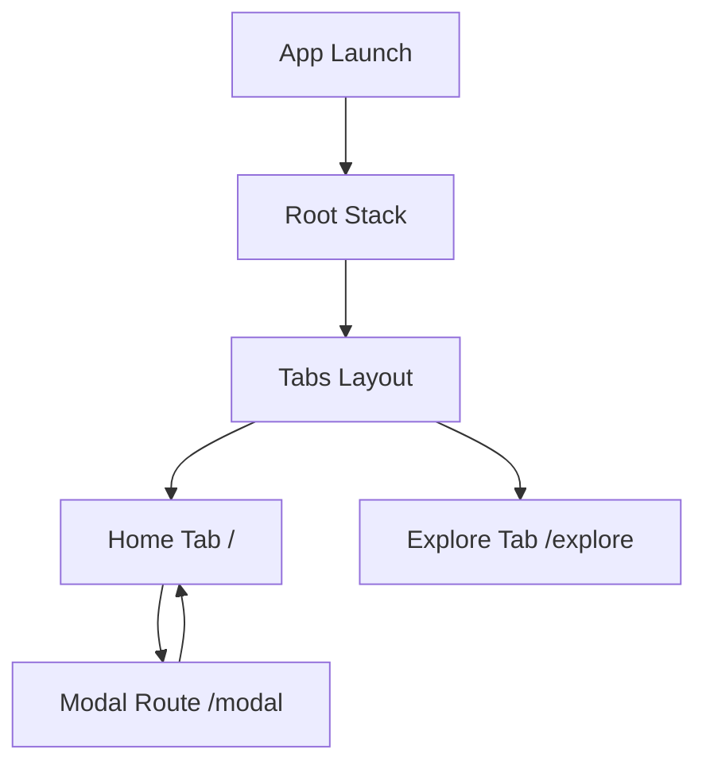

# Navigation Flow

```mermaid
flowchart TD
  A[App Launch] --> B[Root Stack]
  B --> C[Tabs Layout]
  C --> D[Home Tab /]
  C --> E[Explore Tab /explore]
  D --> F[Modal Route /modal]
  F --> D
```

## Notes
- Root stack hosts tab navigator and modal route.
- Home and Explore are sibling tab routes.
- Modal is presented above tabs and dismisses to Home.
