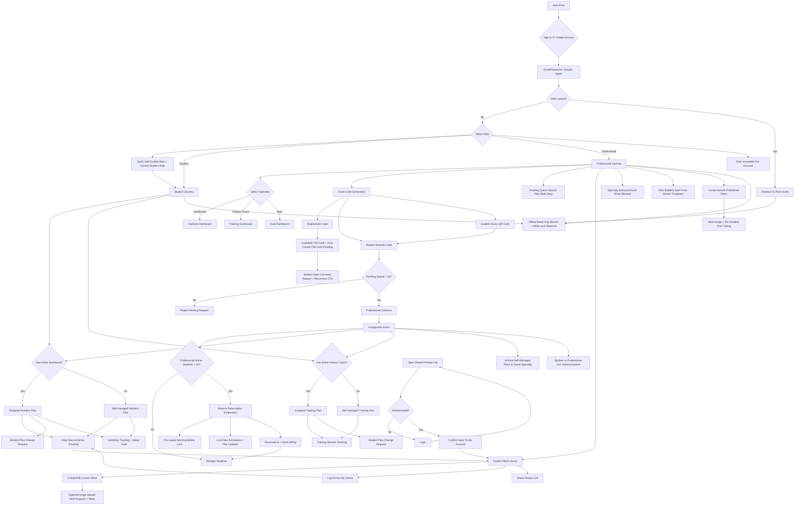

# Role Journey Flow (Proposed)

```mermaid
flowchart TD
  A[Auth Entry] --> A1{Sign In Or Create Account}
  A1 --> A2[Email/Password, Google, Apple]
  A2 --> A3{Role Locked?}
  A3 -->|No| B{Select Role}
  A3 -->|Yes| A4[Redirect To Role Home]
  B --> B1[Quick Self-Guided Start + Commit Student Role]
  B1 --> C
  B -->|Student| C[Student Journey]
  B -->|Professional| D[Professional Journey]
  B --> Q[Role Immutable Per Account]

  D --> E{Select Specialty}
  E -->|Nutritionist| F[Nutrition Dashboard]
  E -->|Fitness Coach| G[Training Dashboard]
  E -->|Both| H[Dual Dashboard]
  D --> R[Invite Code Generation]
  R --> R1[Regenerate Code]
  R1 --> R2[Invalidate Old Code + Auto-Cancel Old-Code Pending]
  R2 --> R3[Student Sees Canceled Reason + Reconnect CTA]
  R --> S[Student Submits Code]
  R --> S0[Student Scans QR Code]
  S0 --> S
  S --> S1{Pending Queue < 10?}
  S1 -->|No| S2[Reject Pending Request]
  D --> S3[Pending Queue Search Filter Bulk Deny]
  S1 -->|Yes| T[Professional Confirms]
  T --> U[Assignment Active]
  U --> W{Professional Active Students > 10?}
  W -->|No| X[Manage Students]
  W -->|Yes| Y[Require Subscription Entitlement]
  Y --> Y0[Pre-Lapse Warning Before Lock]
  Y --> Y1[Lock New Activations + Plan Updates]
  Y --> Z[RevenueCat + Store Billing]
  Z --> X

  C --> I{Has Active Nutritionist?}
  I -->|Yes| J[Assigned Nutrition Plan]
  I -->|No| K[Self-managed Nutrition Plan]

  C --> L{Has Active Fitness Coach?}
  L -->|Yes| M[Assigned Training Plan]
  L -->|No| N[Self-managed Training Plan]

  J --> O[Daily Macro/Calorie Tracking]
  J --> O1[Student Plan-Change Request]
  J --> O2[Hydration Tracking + Water Goal]
  K --> O
  K --> O2
  D --> AB
  O --> AB[Custom Meal Library]
  AB --> AC[Create/Edit Custom Meal]
  AC --> AC1[Optional Image Upload With Progress + Retry]
  AB --> AD[Log Portion By Grams]
  AB --> AE[Share Recipe Link]
  AF[Open Shared Recipe Link] --> AH{Authenticated?}
  AH -->|No| AI[Login]
  AI --> AF
  AH -->|Yes| AG[Confirm Save To My Account]
  AG --> AB
  AD --> O
  M --> P[Training Session Tracking]
  M --> P1[Student Plan-Change Request]
  N --> P
  U --> I
  U --> L
  U --> V[Archive Self-Managed Plans In Same Specialty]
  U --> AA[Student or Professional Can Unbind Anytime]
  D --> D1[Specialty Removal Assist When Blocked]
  D --> D2[Plan Builders Start From Starter Templates]
  D --> D3[Create Named Predefined Plans]
  D3 --> D4[Bulk Assign + Per-Student Fine-Tuning]
  A4 --> OFF[Offline Read-Only Banner + Write-Lock Reasons]
  C --> OFF
  D --> OFF
```
