# Screen State Flows V2 (Batch 1)

## SC-217 Auth Sign-In
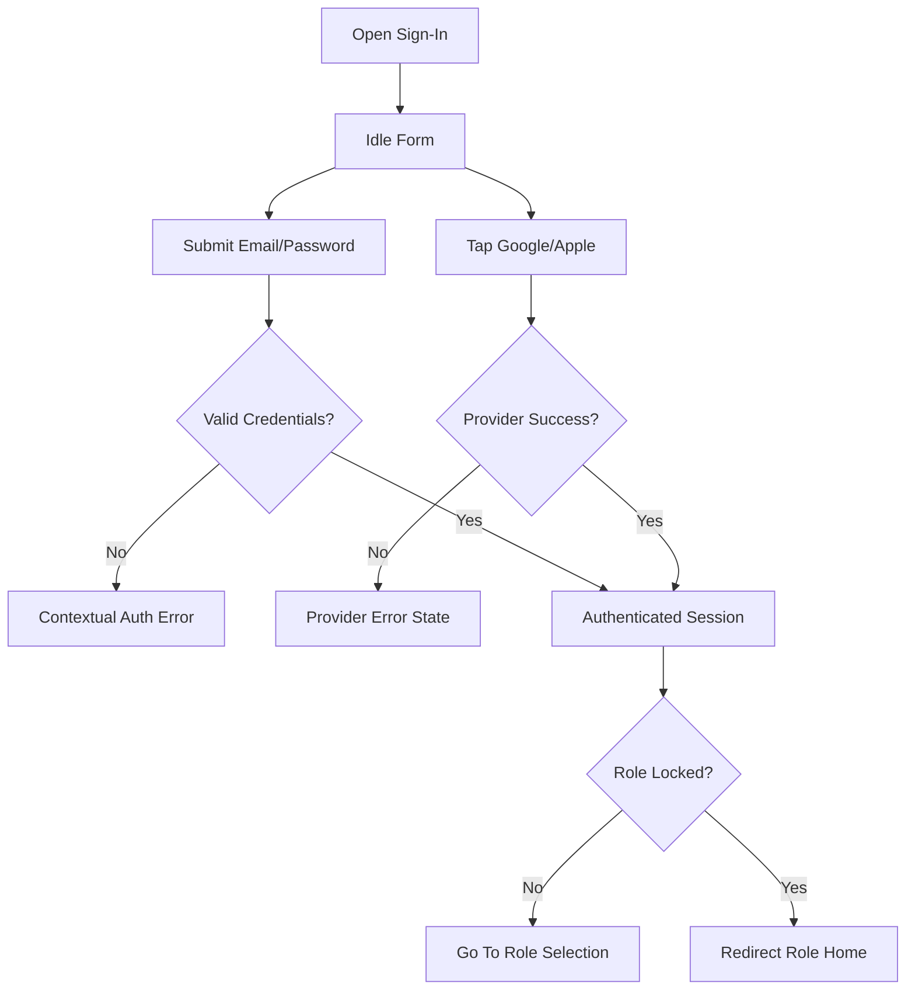

## SC-218 Auth Create Account
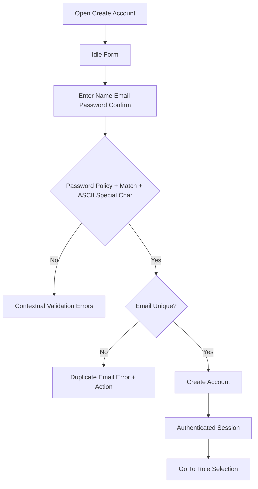

## SC-201 Auth Role Selection
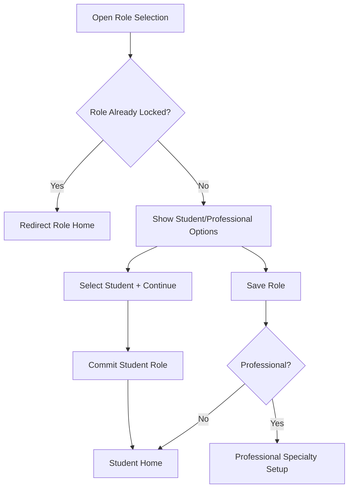

## SC-202 Professional Specialty Setup
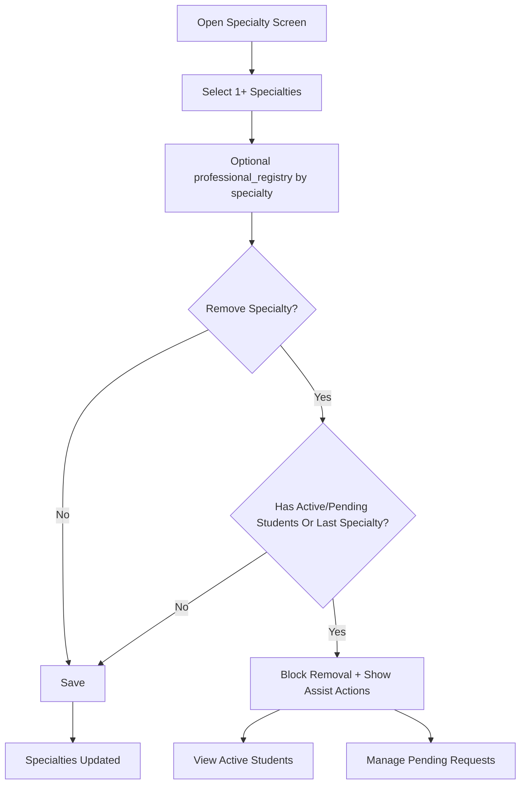

## SC-203 Student Home Dashboard
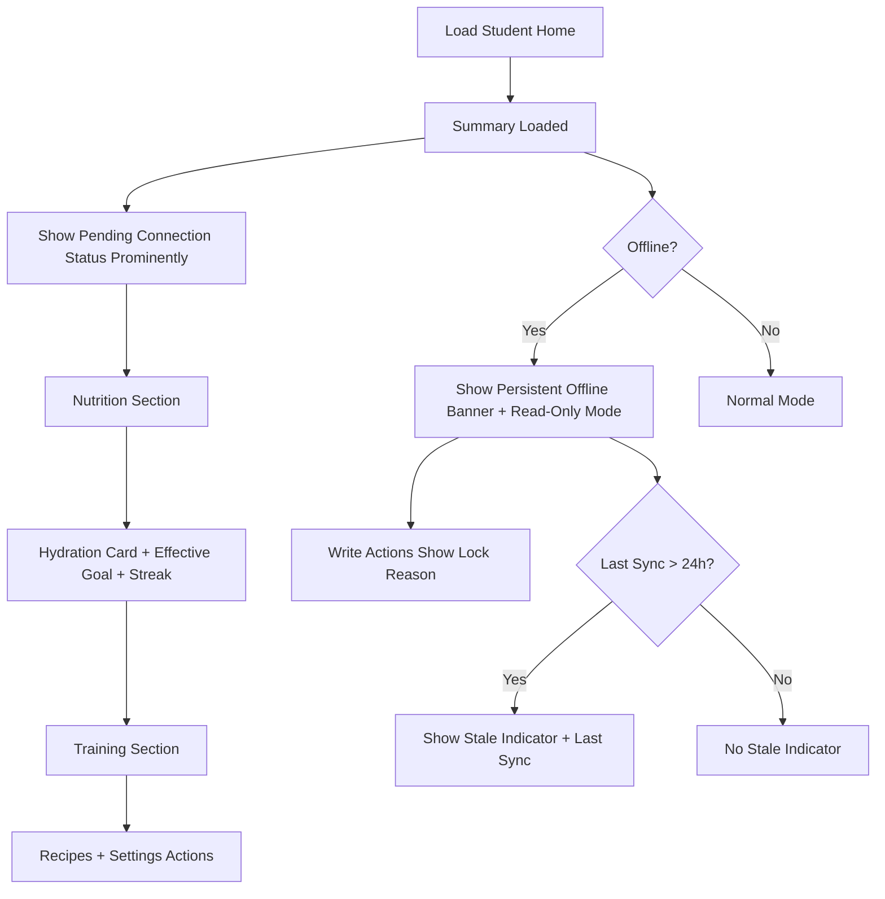

## SC-204 Professional Home Dashboard
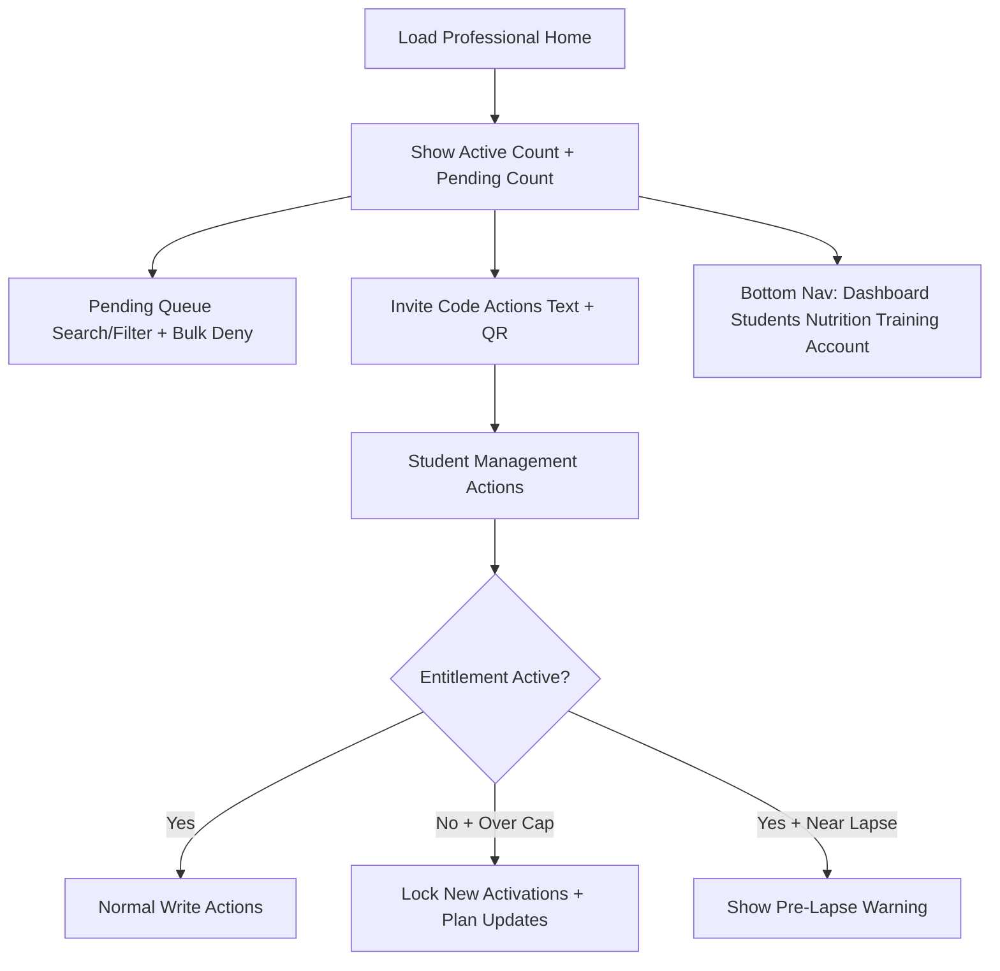

## SC-211 Relationship Management
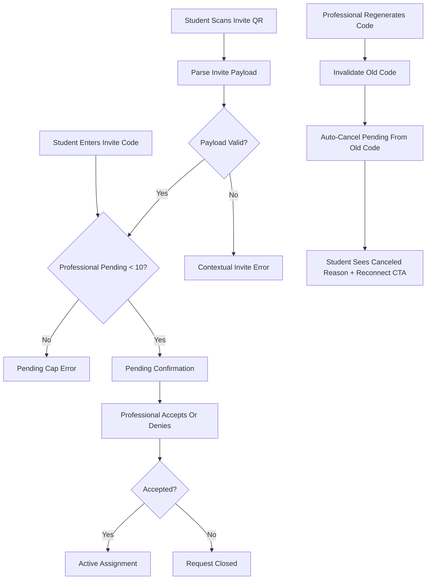

## SC-212 Professional Subscription Gate
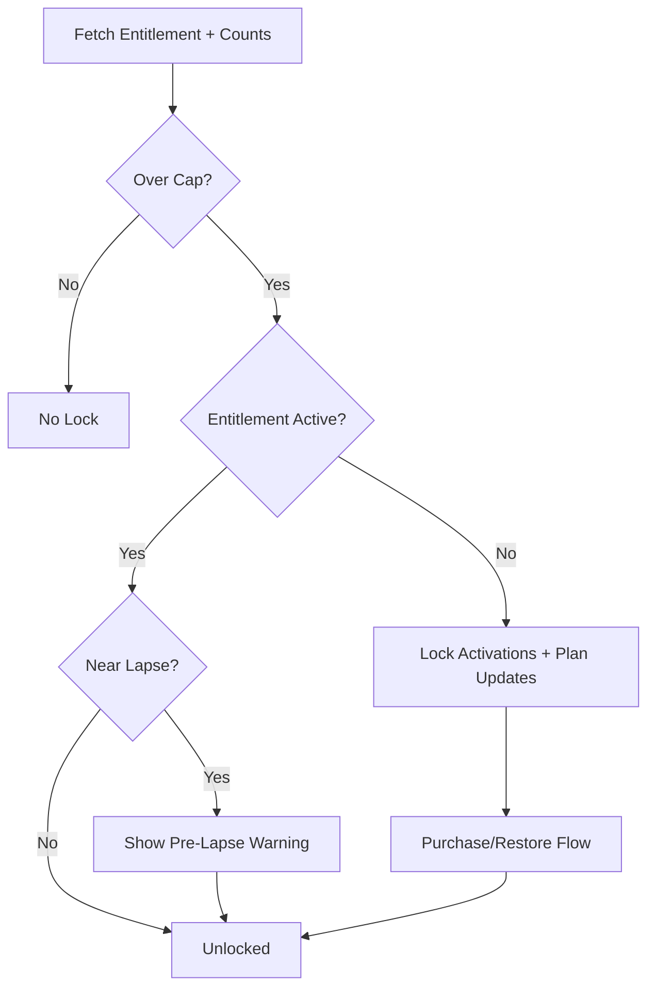

## SC-205 Student Roster Pending Queue
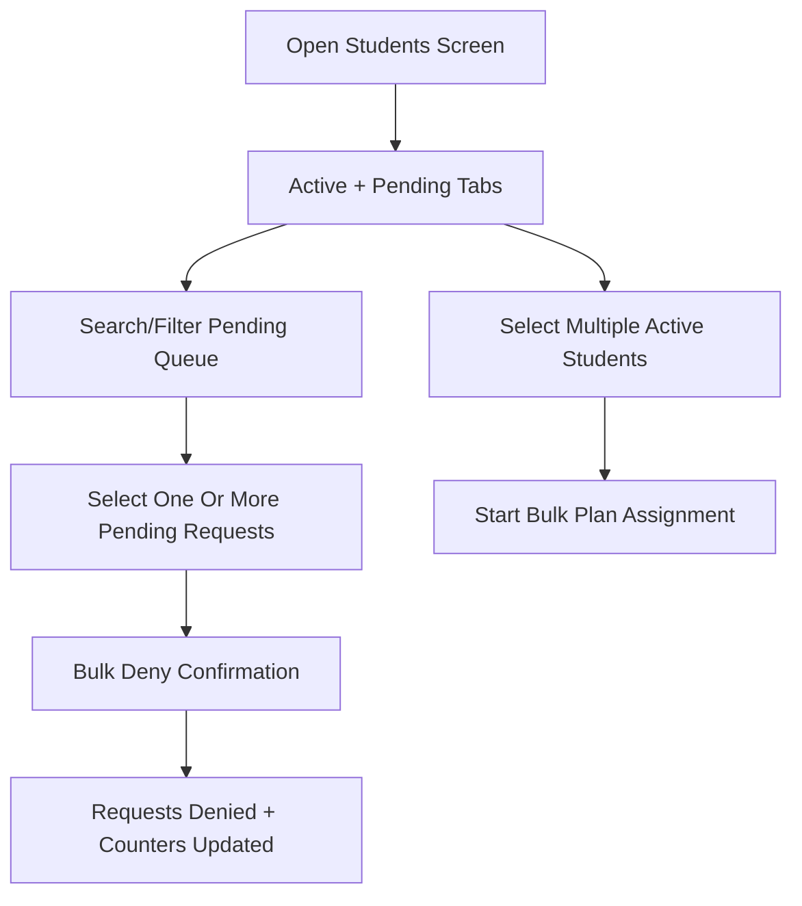

## SC-207/SC-208 Starter Template Flow
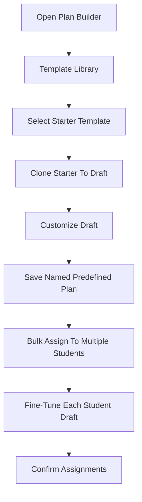

## SC-209 Hydration Tracking
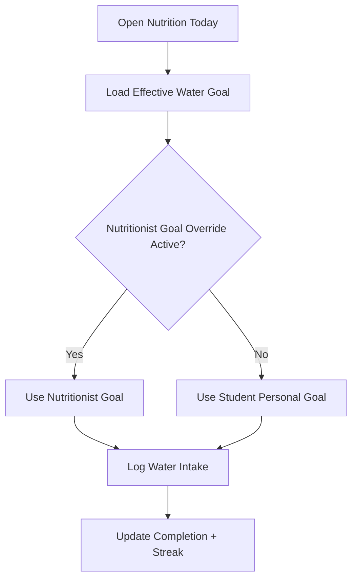

## SC-214 Recipe Image Upload
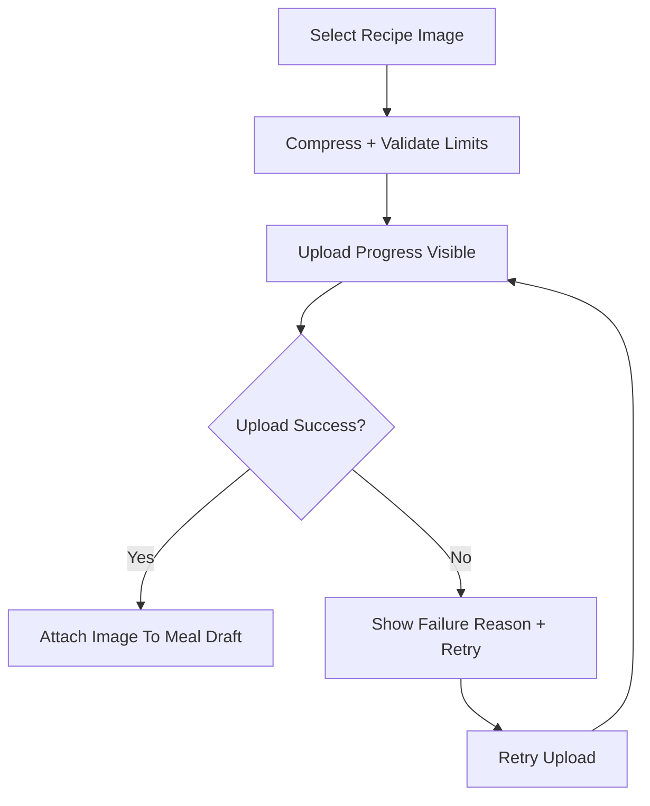
