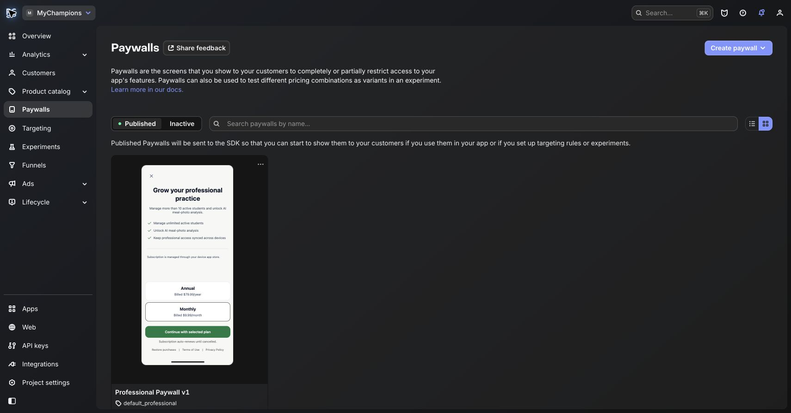
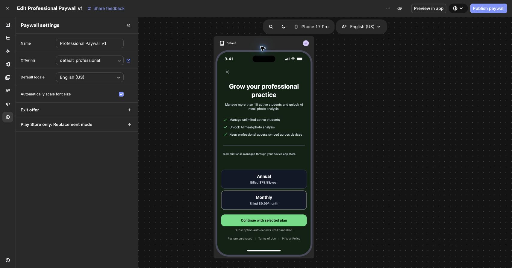
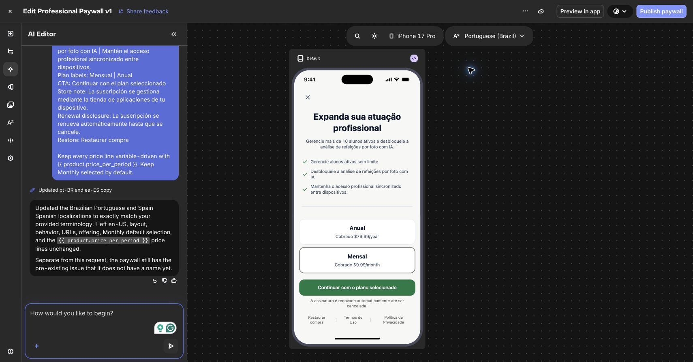
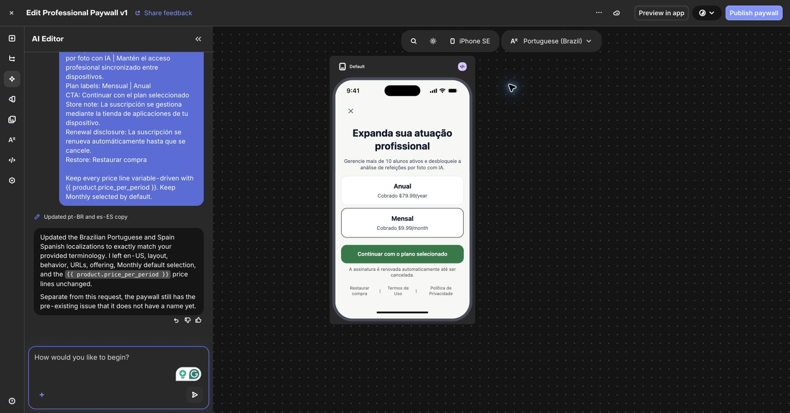
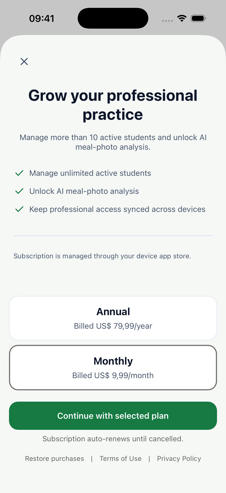
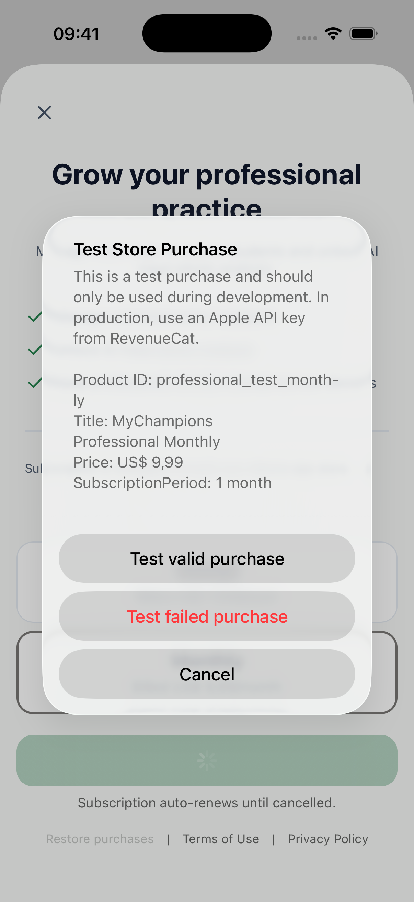
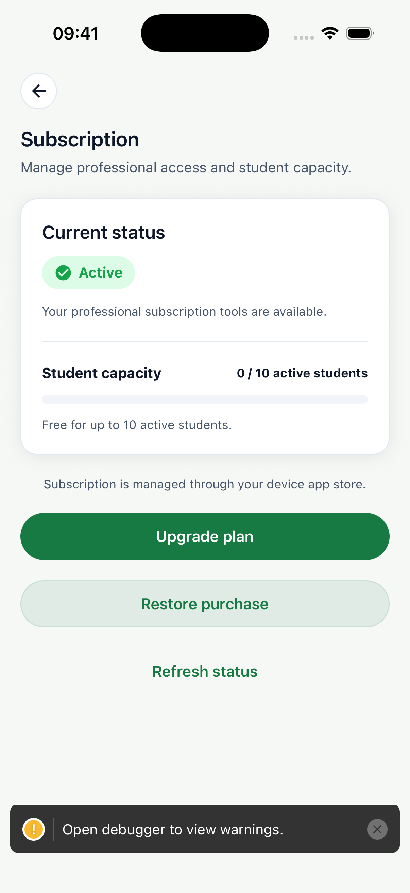
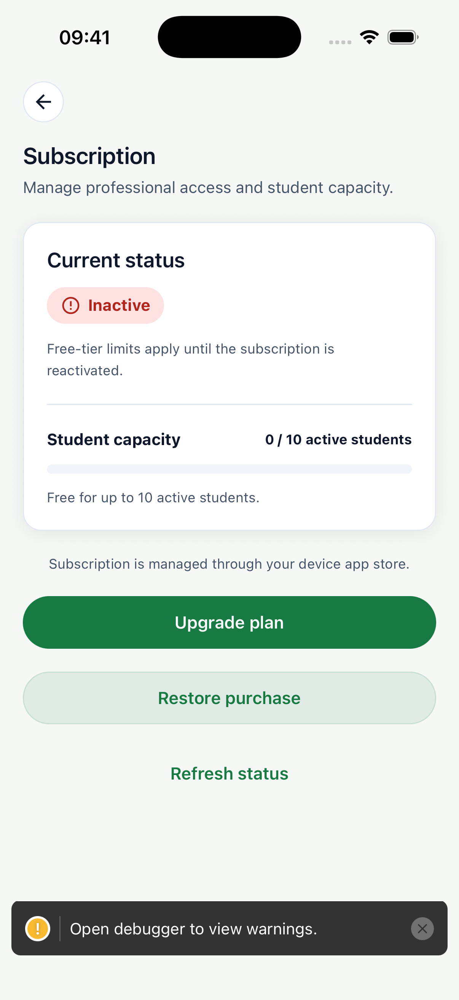
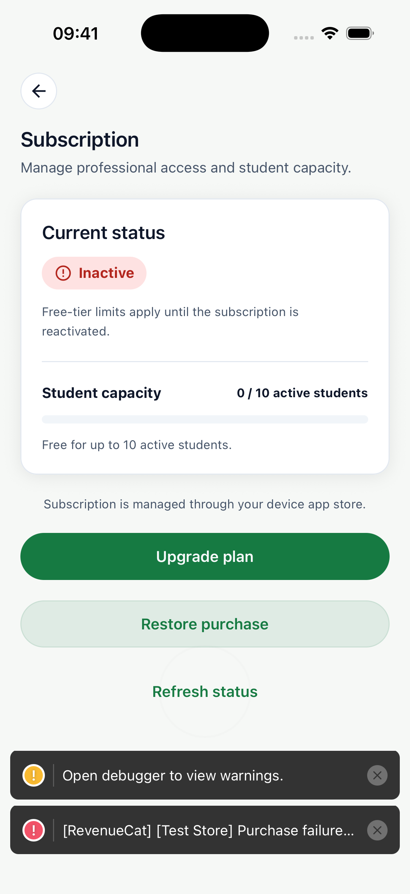

# RevenueCat Professional Paywall v1 Evidence Report

Date: 2026-07-24 (original live Test Store evidence)
Environment: RevenueCat project `49195782`, MyChampions development app, iPhone 17 / iOS 26.5, RevenueCat Test Store

Dashboard re-verification: 2026-07-26. `Professional Paywall v1` remains the
published production paywall on `default_professional`. A separate
`test_professional` offering and `Professional Paywall v1 Test` were created,
bound to the professional Test Store annual/monthly products, and published
for the explicit development/Test Store route.

## Outcome

`Professional Paywall v1` is published in RevenueCat, attached to offering
`default_professional`, and delivered by the production
`Purchases.getOfferings().all['default_professional']` ->
`RevenueCatUI.presentPaywall({ offering })` path. The explicit development
Test Store route now resolves `test_professional` and presents the separately
published `Professional Paywall v1 Test`.

This dashboard change did not repeat the device/Test Store purchase matrix;
the existing live evidence below proves the production offering's paywall and
professional entitlement behavior, while the new Test Store surface still
needs its own fresh device smoke run.

The live Test Store run proved:

- the published custom paywall replaces the RevenueCat fallback surface;
- dismissal, cancellation, and simulated purchase failure do not grant access;
- a valid professional purchase activates only the professional privilege;
- a non-destructive restore keeps the professional privilege active;
- switching to an unrelated account does not leak the purchaser's privilege;
- a student privilege does not unlock professional capabilities.

No App Store Connect, Google Play, credential, deployment, merge, or production
mobile release action was performed in this batch.

## Provider Configuration

| Field | Confirmed value |
|---|---|
| Paywall ID | `pwb482ef7d20a04e4f` |
| Name | `Professional Paywall v1` |
| State | Published |
| Offering | `default_professional` (`ofrng54107c9a49`) |
| Packages shown | Annual and Monthly; Monthly selected by default |
| Price source | RevenueCat product variables, including `{{ product.price_per_period }}` |
| Locales | `en-US`, `pt-BR`, `es-ES` |
| Appearance | Light and dark |
| Legal destinations | Existing MyChampions Terms and Privacy URLs |
| SDK compatibility | Installed React Native RevenueCat SDK `9.15.2`; dashboard minimum was `8.11.3` |

The dashboard's Published view shows the paywall bound to
`default_professional`:

The 2026-07-26 dashboard verification also shows the separate Test Store
surface:

| Field | Confirmed value |
|---|---|
| Paywall ID | `pw01d94819b83e4dfe` |
| Name | `Professional Paywall v1 Test` |
| State | Published |
| Offering | `test_professional` (`ofrng2d1347eab0`) |
| Packages | Monthly -> `professional_test_monthly`; Annual -> `professional_test_annual` |
| Entitlement contract | Both Test Store products attach to `professional_pro` |
| Design source | Duplicated from the published `Professional Paywall v1` design |
| Device evidence | Not repeated in this dashboard-only promotion step |

## Design Review

The paywall follows the app's current visual language:

- light canvas and surface treatment with navy primary text;
- the existing MyChampions green for benefits and the primary CTA;
- rounded package cards, restrained borders, and no decorative media;
- clear hierarchy from value proposition to package selection, CTA, renewal
  disclosure, restore, and legal links;
- dark appearance aligned with the app's dark canvas, surface, text, border,
  and accent tokens.

Dark-mode editor review:

Brazilian Portuguese review:

Smallest reviewed layout:

The iPhone SE template responsively reduces optional explanatory content, while
close, both packages, purchase, renewal disclosure, restore, Terms, and Privacy
remain present and unclipped.

## Live App Evidence

Published paywall received by the installed app:

The native accessibility tree exposed the headline, value proposition, each
benefit, Annual and Monthly buttons with price/period, purchase CTA, renewal
disclosure, restore, Terms, and Privacy. The Detox contract now asserts those
native accessibility labels before interacting with the paywall.

RevenueCat Test Store outcome sheet reached from the custom CTA:

Valid purchase:

Restore:

Dismissal without purchase:

Simulated failed purchase:

The dark warning toast at the bottom of some simulator screenshots belongs to
the Expo development client and is not rendered by the paywall or a production
build.

## Detox Coverage

The live spec is
`e2e/revenuecat-test-store.e2e.test.js`. It was updated to assert the custom
SwiftUI paywall's accessibility contract, use its leading close control, handle
both direct and intermediate Test Store confirmation behavior, and acknowledge
the intentional Test Store failure alert before checking fail-closed state.

| Scenario | Result | Evidence |
|---|---|---|
| Published V1 propagates and dismiss grants nothing | Passed | Custom headline/plans/CTA/restore/legal selectors plus inactive screenshot |
| User cancels Test Store purchase | Passed | Entitlement remains inactive |
| Test Store simulates purchase failure | Passed | Error acknowledged; entitlement remains inactive before and after refresh |
| Valid professional purchase | Passed | `Subscription: Active`; no renewal warning |
| Reinstall/state retention plus restore call | Passed | Professional privilege remains active |
| Account switch | Passed | Unrelated Google fixture inactive; original purchaser active on return |
| Student/professional isolation | Passed | Student privilege active for student fixture; professional screen remains inactive |
| Accelerated renewal/expiration monitor | Not repeated in this paywall batch | Previously proven by the subscription-hardening live batch; the paywall batch changed presentation and interaction only |

The final green evidence is split across lifecycle-compatible Test Store
customers because purchase success intentionally changes durable provider
state. The full run passed propagation, cancellation, valid purchase, restore,
account isolation, and cross-entitlement isolation; the final focused
failed-purchase run passed after adding the native error-alert acknowledgement.

## Implementation Notes

RevenueCat's SwiftUI hosting view reports activation points below the visible
viewport under iOS 26.5. The test therefore:

1. asserts the intended visible accessibility control and copy;
2. taps the rendered iPhone 17 coordinate for the CTA or close control;
3. waits for the provider-owned next state before continuing.

This preserves semantic assertions and limits coordinate use to the native
hosting-view defect. It is pinned to the existing iPhone 17 live configuration.

The Test Store preview renders US prices with the simulator's locale formatting
and English `/year` or `/month` period suffix. Prices and periods are provider
variables, not hard-coded app or paywall copy.

## Scope Boundaries and Residual Risk

- `Professional Paywall v1` is published on `default_professional` and
  `Professional Paywall v1 Test` is published on `test_professional`; no
  RevenueCat Targeting rule was created. Production/normal development stays
  on the default offering, while only the explicit dev/Test Store build can
  select the test offering.
- The live proof uses RevenueCat Test Store. It is not App Store receipt restore
  evidence and not Google Play purchase-token restore evidence.
- `default_student` now has the published `Student Paywall v1 Production`; the
  student Test Store variant remains published on `test_student`.
- Android custom-paywall rendering and interaction were not exercised because
  the development Android RevenueCat app/catalog and licensed Play test path are
  still pending.
- Largest-phone, Dynamic Type, screen-reader focus traversal, and RTL behavior
  should be added to the platform-store validation batch. This review covered
  standard iPhone 17, iPhone SE preview, light/dark, and the native accessibility
  tree.
- App Store product metadata, Google Play products/base plans, and true
  two-platform sandbox purchase/reinstall/restore evidence remain release
  blockers.

## Recommendation

Accept `Professional Paywall v1` and `Professional Paywall v1 Test` as the
published production/Test Store professional pair and retain the existing live
Detox contract for the production offering. Run a fresh device/Test Store smoke
against `test_professional` before treating the new surface as provider-backed
rendering evidence. Do not mark the broader subscription release gate complete
until the Android provider/catalog work, App Store metadata, updated student
copy smoke run, and true App Store/Google Play sandbox restore evidence are
reviewed.
