# RevenueCat Student Paywall v1 Evidence Report

Dashboard verification date: 2026-07-26
Environment: RevenueCat project `49195782`, MyChampions app. The Test Store
variant is attached to the development `test_student` offering; the production
variant is attached to `default_student`.

## Controlled-batch outcome

The approved Test Store slice created and published `Student Paywall v1 Test`
on the temporary development offering `test_student`. On 2026-07-26 the
student design was refined in the RevenueCat editor, localized in all three
supported locales, republished to `test_student`, duplicated as `Student
Paywall v1 Production`, bound to `default_student`, and published.

After visual review against the professional paywall, both published student
variants were rebalanced in the RevenueCat editor and republished. The live
iPhone 17 Pro previews now use a 16 px root cadence, a 72 px top margin on the
student value-proposition header, and an 8 px purchase-footer cadence with
12/16/16/16 px top/right/bottom/left padding. The title/benefit block and the
fixed purchase footer now read as one centered composition without the former
dominant disconnected middle gap. Product bindings, offerings, entitlements,
copy, locale coverage, and monthly default were not changed. This is dashboard
preview evidence; a fresh device/Test Store smoke run remains required before
the visual refinement is treated as new device-rendering evidence.

The app now routes AI upgrades by the account's locked role:

- student accounts resolve `default_student`, except an explicit development
  Test Store build resolves `test_student`;
- professional accounts resolve `default_professional`, except an explicit development Test Store build resolves `test_professional`;
- missing or malformed roles fail closed without presenting a paywall.

Existing valid `student_pro` entitlements remain backward-compatible and unlock
AI regardless of role. A professional cannot initiate a new student purchase
from the app.

No mobile release, App Store Connect or Google Play purchase, Android
provider-rendering run, deployment, or merge was performed in this batch. The
dashboard publication is provider configuration evidence; the updated copy and
layout still need a fresh device/Test Store smoke run before they are treated
as new live-rendering evidence.

## Provider configuration

### Test Store student paywall

| Field | Confirmed value |
|---|---|
| Paywall ID | `pw92ab4568bc274596` |
| Name | `Student Paywall v1 Test` |
| State | Published |
| Offering | `test_student` (`ofrng29278ed23b`) |
| Packages | `$rc_monthly` -> `student_test_monthly`; `$rc_annual` -> `student_test_annual` |
| Entitlement contract | Both student products grant only `student_pro` |
| Default selection | Monthly |
| Price source | RevenueCat product variables, including `{{ product.price_per_period }}` and annual `{{ product.price_per_month }}` |
| Locales | `en-US`, `pt-BR`, `es-ES` |
| Appearance | Light and dark |
| Allowlist | Exact 13 approved Test Store customer IDs |

The temporary offering contains only the two approved student packages:

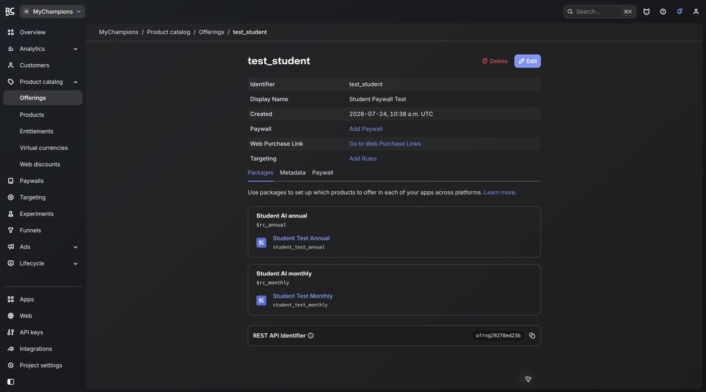

### Production student paywall

| Field | Confirmed value |
|---|---|
| Paywall ID | `pw7efb288b4e9540f5` |
| Name | `Student Paywall v1 Production` |
| State | Published |
| Offering | `default_student` (`ofrng44a9709361`) |
| Packages | `$rc_monthly` -> `student_monthly`; `$rc_annual` -> `student_annual` |
| Entitlement contract | Both student products grant only `student_pro` |
| Default selection | Monthly |
| Price source | RevenueCat product variables, including `{{ product.price_per_period }}` and annual `{{ product.price_per_month }}` |
| Locales | `en-US`, `pt-BR`, `es-ES` |
| Appearance | Light and dark |

The 2026-07-26 Published view contains four paywalls: `Student Paywall v1
Production` on `default_student`, `Student Paywall v1 Test` on `test_student`,
`Professional Paywall v1` on `default_professional`, and `Professional Paywall
v1 Test` on `test_professional`. The Inactive view is empty.

The student close action was remediated during the live matrix after the first
native accessibility assertion exposed an unlabeled control. The published
paywall now exposes localized `Close`, `Fechar`, and `Cerrar` labels while
retaining the close icon and compact layout:

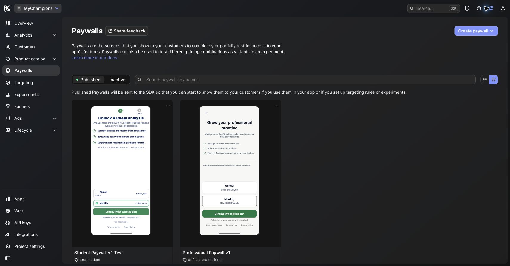

The exact Test Store allowlist was reopened after saving and showed 13 customer
IDs:

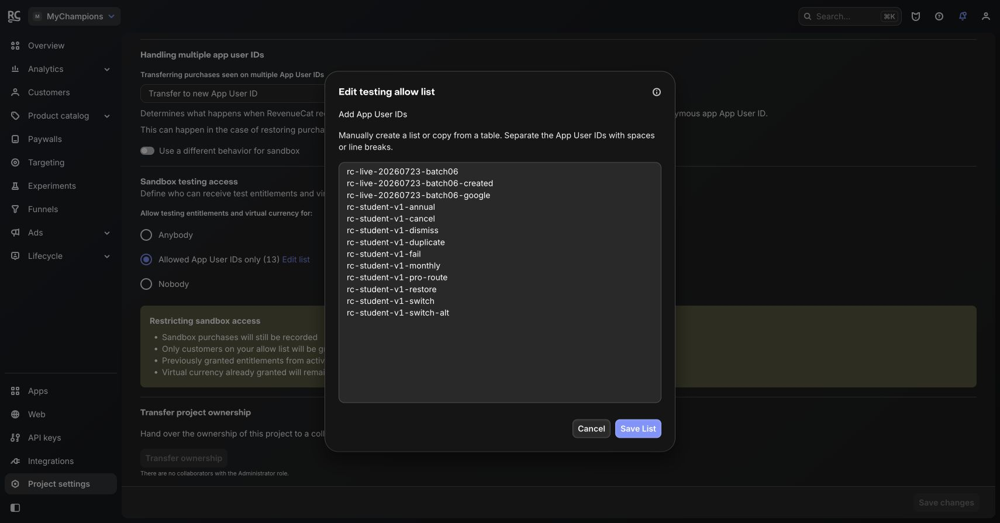

## Design and localization review

The student design uses the MyChampions visual tokens and the same interaction
order as the professional paywall, while keeping its own value proposition.
The 2026-07-26 revision tightened the hierarchy without changing product
bindings or interaction order:

- camera/sparkles header with no decorative media;
- AI meal-photo analysis only, with no professional-capacity messaging;
- all three approved student benefits;
- provider-driven Monthly and Annual prices;
- close, selected-plan indication, CTA, renewal disclosure, restore, Terms,
  Privacy, and native accessibility labels.
- centered vertical composition aligned to the professional preview, with a
  16 px root cadence and an 8 px purchase-footer cadence;

Final dashboard copy was verified in all three locales:

| Surface | English | Portuguese (Brazil) | Spanish |
|---|---|---|---|
| Headline | Unlock AI meal analysis | Desbloqueie a análise de refeições com IA | Desbloquea el análisis de comidas con IA |
| Supporting copy | Turn a meal photo into a reviewable estimate. Standard meal tracking stays free. | Transforme uma foto de refeição em uma estimativa revisável. O rastreamento padrão de refeições continua gratuito. | Convierte una foto de tu comida en una estimación revisable. El seguimiento de comidas estándar sigue siendo gratuito. |
| Primary CTA | Unlock AI meal analysis | Desbloqueie a análise de refeições por IA | Desbloquea el análisis de comidas con IA |
| Renewal disclosure | Subscription renews automatically. Cancel anytime. | A assinatura é renovada automaticamente. Cancele a qualquer momento. | La suscripción se renueva automáticamente. Cancela en cualquier momento. |

The existing editor screenshots below are historical 2026-07-24 baseline
captures; the final text above is the authoritative 2026-07-26 dashboard
verification.

English light appearance:

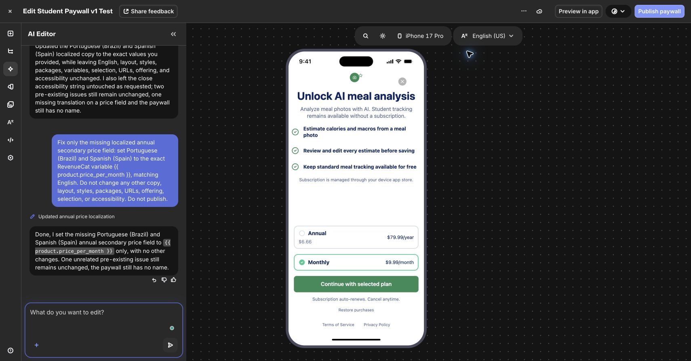

English dark appearance:

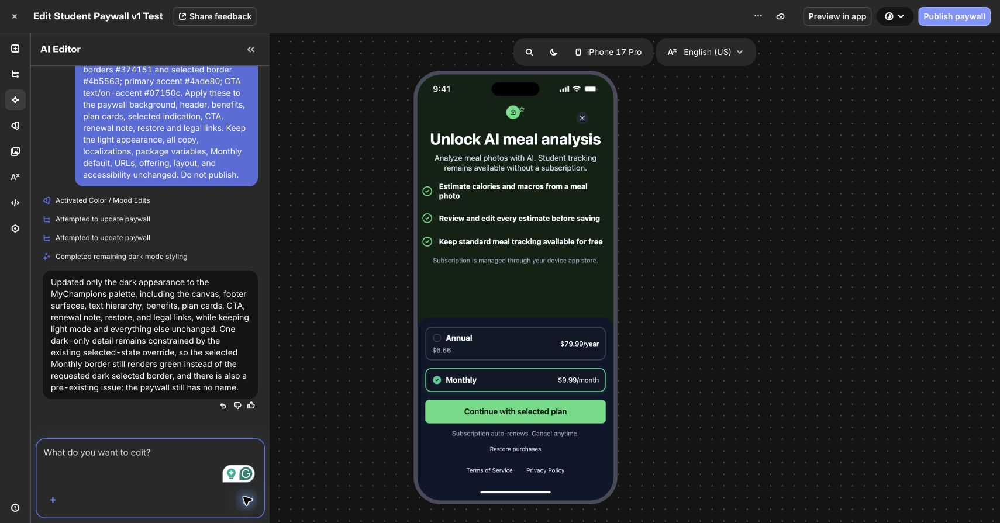

Brazilian Portuguese:

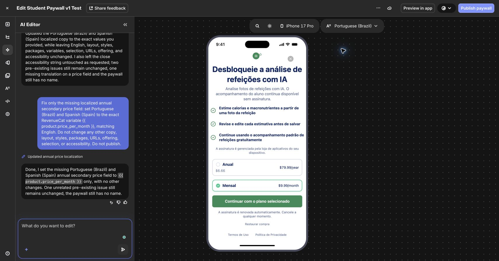

Spanish (Spain):

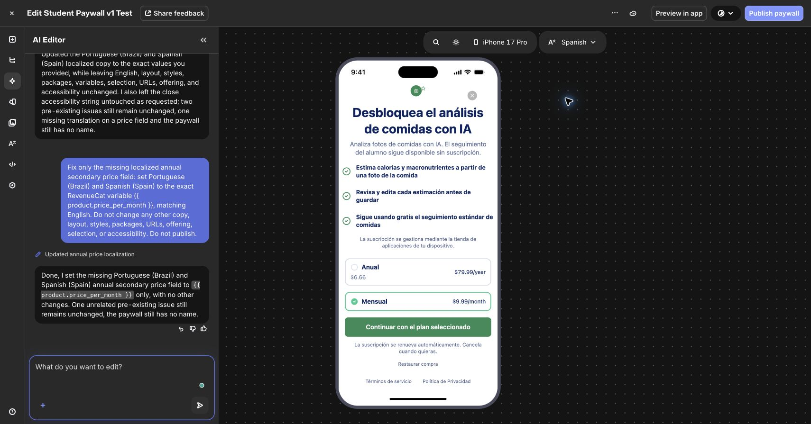

The compact layout was specifically tightened so the iPhone SE preview keeps
all three benefits, both packages, CTA, renewal, restore, legal links, and close
control present and unclipped:

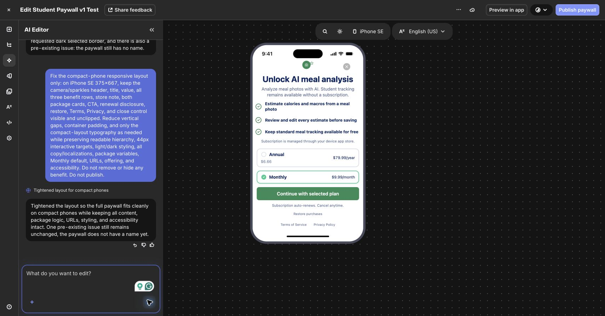

Largest reviewed phone:

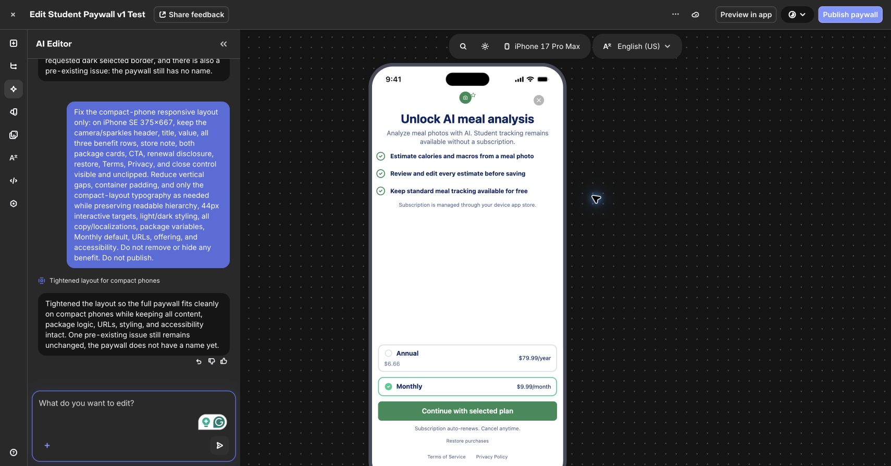

## App implementation

The app configuration accepts `test_student` only when all three guards are
true: development variant, Test Store enabled, and explicit student-offering
override. Production and normal development resolve `default_student`;
production rejects the temporary override.

`openAiUpgradePaywall(role)` is the single role-aware action used by both
custom-meal AI entry points. Offering-specific provider presentation remains
internal and independently unit-tested.

The live Detox spec keeps student and professional paywall contracts separate:
copy, package labels, legal labels, native coordinates, and expected
entitlements are not shared. Each scenario runs with a dedicated allowlisted
customer.

## Automated validation

| Check | Result |
|---|---|
| App config, offering resolver, role resolver, entitlement logic, E2E identity tests | Passed: 121/121 |
| JavaScript syntax for live Detox spec | Passed |
| Shell syntax for both RevenueCat live runners | Passed |
| Targeted ESLint | Passed |
| `git diff --check` | Passed |
| Workspace TypeScript | Not used as a green gate: the workspace retains unrelated pre-existing `fetch.preconnect` errors |

## Live Test Store matrix

| Scenario | Dedicated customer | Result | Required proof |
|---|---|---|---|
| Student paywall propagation and dismissal | `rc-student-v1-dismiss` | Passed | Student V1 and native close label visible; dismissal grants nothing |
| Cancellation | `rc-student-v1-cancel` | Passed | Neither entitlement is granted |
| Simulated failure | `rc-student-v1-fail` | Passed | Neither entitlement is granted |
| Duplicate purchase activation | `rc-student-v1-duplicate` | Passed | One provider sheet; cancellation grants nothing |
| Monthly purchase | `rc-student-v1-monthly` | Passed | AI active; professional capability inactive |
| Annual purchase | `rc-student-v1-annual` | Passed | Annual selected; AI active; professional capability inactive |
| Reinstall and Test Store restore | `rc-student-v1-restore` | Passed | Student AI restored; professional capability inactive |
| Account switching | `rc-student-v1-switch` / `rc-student-v1-switch-alt` | Passed | Alternate locked; purchaser active after return |
| Professional AI route | `rc-student-v1-pro-route` | Passed | Professional V1 shown; only professional privilege purchased; AI active |

All nine approved live scenarios passed. The final focused professional-route
run passed in 47.239 seconds after the independent professional renewal-copy
matcher was corrected to match its existing published paywall.

Live student paywall:

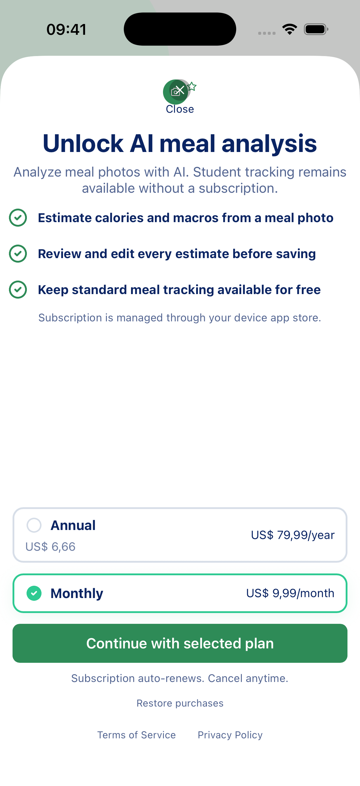

Monthly student purchase activates AI while professional capacity remains
inactive:

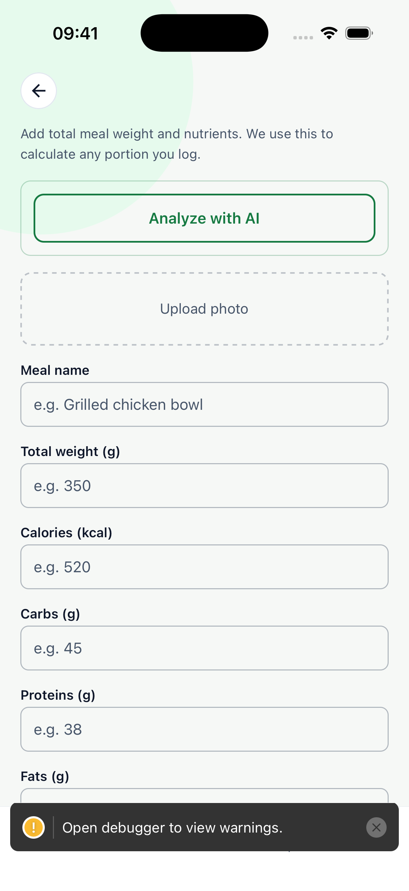

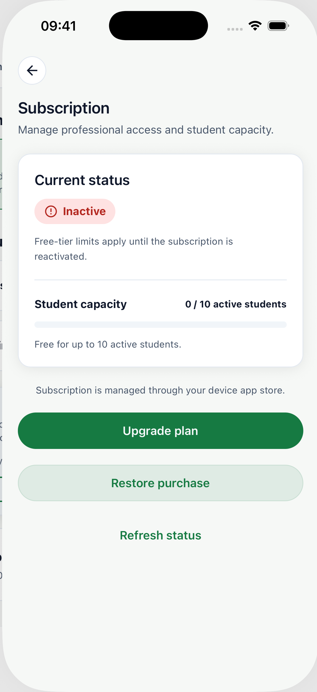

Reinstall and Test Store restore recover student AI without granting the
professional privilege:

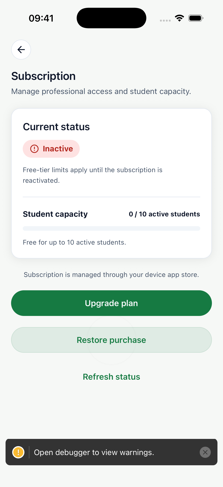

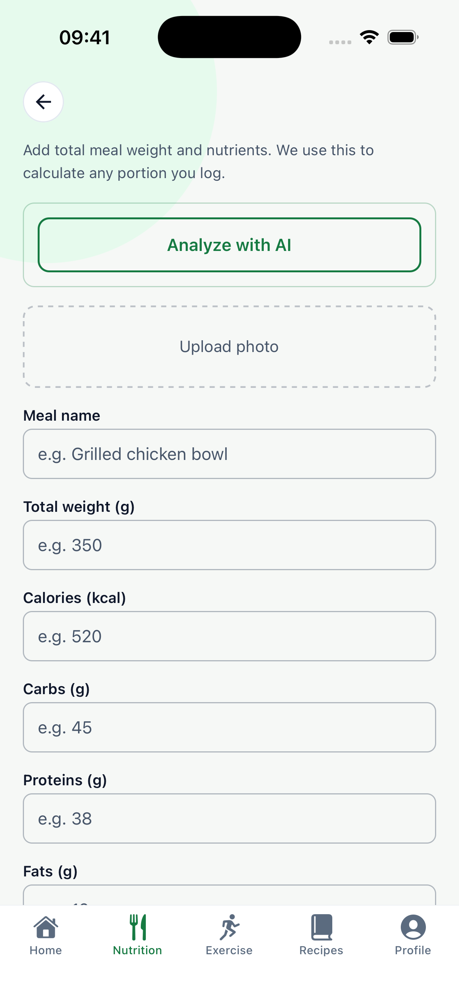

Account switching is isolated:

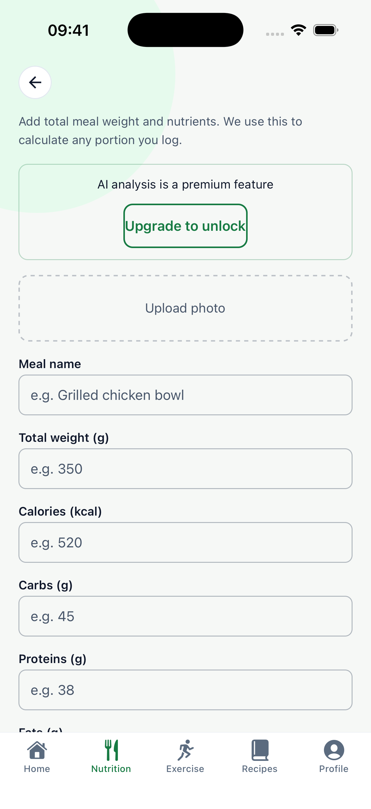

The professional AI gate presents the independent professional design and
activates professional access:

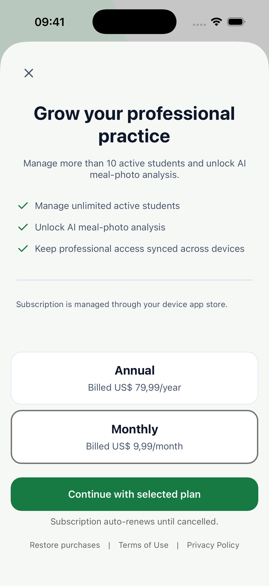

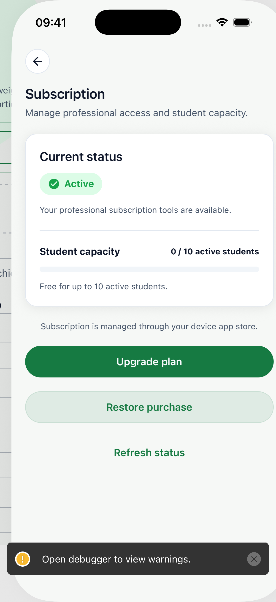

## Provider entitlement isolation

RevenueCat sandbox customer evidence independently confirms the live app
assertions. `rc-student-v1-monthly` has exactly `student_pro` backed by
`student_test_monthly`:

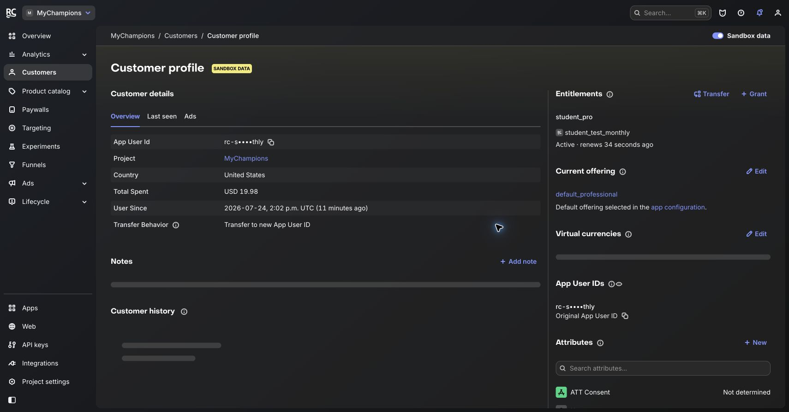

`rc-student-v1-pro-route` has exactly `professional_pro` backed by
`professional_test_monthly`:

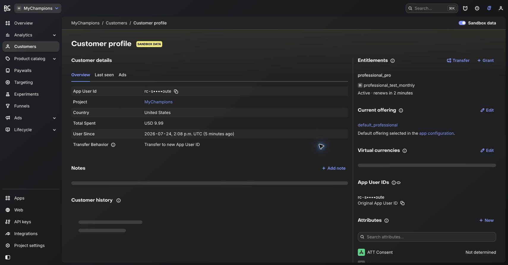

The remaining live captures for cancellation, simulated failure, duplicate
activation, annual purchase, and their provider sheets are retained under
`artifacts/revenuecat-student-paywall-v1-20260724/app/`.

## Scope boundaries

- This is RevenueCat Test Store evidence, not App Store receipt restore or
  Google Play purchase-token restore evidence.
- Both student variants remain published: `test_student` keeps the explicit
  development/Test Store route, and `default_student` now serves the published
  production student paywall. The temporary Test Store paywall was not
  deactivated so the development matrix remains reproducible.
- Development Android RevenueCat app permissions, Android products/base plans,
  App Store missing product metadata, Android live rendering, and true
  two-platform sandbox restore remain separate release-readiness action items.
- The updated student layout has dashboard-preview evidence only; the next
  device/Test Store run must verify the refreshed visual composition on the
  native surface.
- No RevenueCat Targeting rule was created; the app explicitly presents the
  role-resolved offering.
