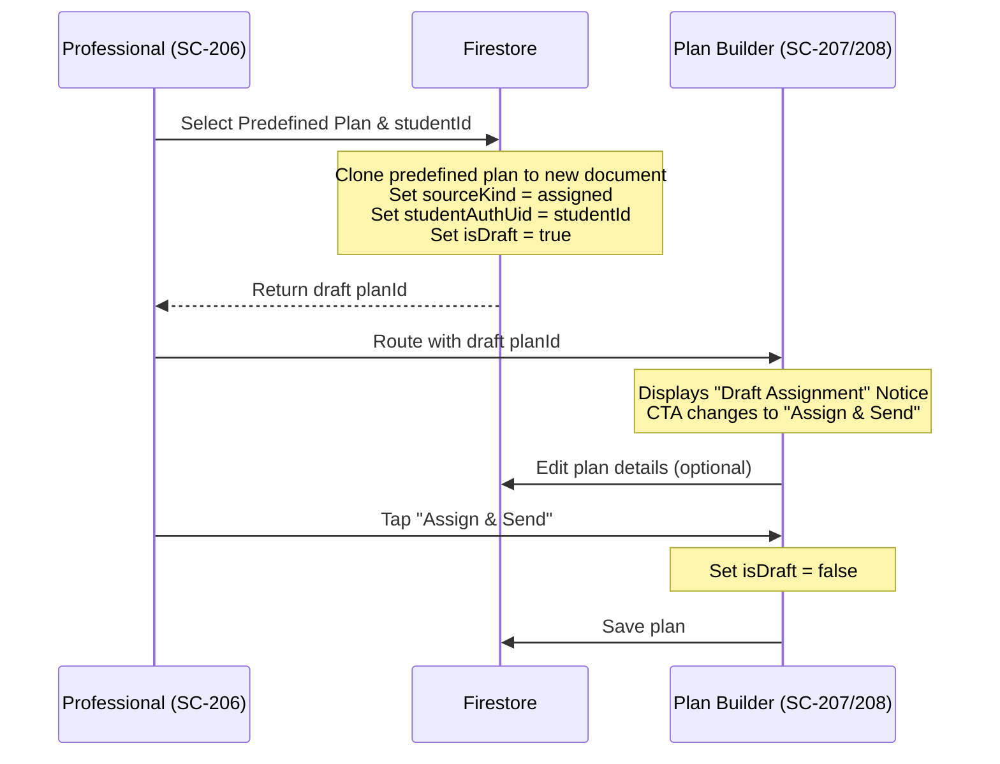
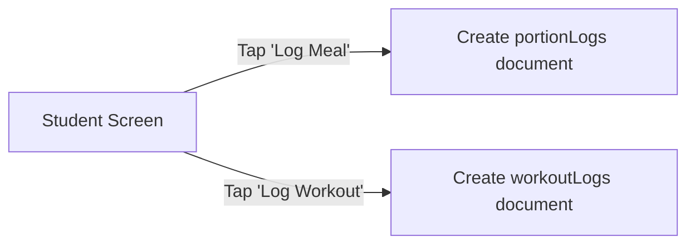

# Spec: Plan Customization Lifecycle and Student Tracking Logs

**Date**: 2026-05-31  
**Status**: Approved  
**Context**: MyChampions connection lifecycle and plan assignment  

---

## 1. Executive Summary

This specification outlines the end-to-end design for:
1. **Draft Customization Flow**: Permitting Professionals to copy and customize predefined plan templates for specific students in a "draft" state before making them live.
2. **Immediate Archival**: Archiving a student's self-managed plan immediately upon connection activation.
3. **Student Inline Viewer & Check-Off Tracking**: Providing students with inline plan details (meals, sessions, targets) on their tracking tabs and allowing one-tap logging directly against these plans.
4. **Professional Logs Access**: Granting specialty-scoped read access to professionals for tracking logs (`portionLogs`, `waterLogs`, `workoutLogs`).

---

## 2. Terminology & Glossary Additions

We extend the canonical domain glossary (`CONTEXT.md`) with the following definitions:

* **Draft Assigned Plan**  
  An assigned plan document (`sourceKind: 'assigned'`) created as a clone of a predefined template where `isDraft: true`. Draft assigned plans are owned by the professional, scoped to a single student, and completely invisible to the student until published (`isDraft` updated to `false`).
* **Portion Log**  
  A student-authored food tracking log document representing a logged meal or food portion. Check-off actions on assigned plans create portion logs using the meal's calculated macro totals.
* **Workout Log**  
  A student-authored exercise tracking log document representing a completed training session.

---

## 3. Detailed Architecture & Workflows

### 3.1. Roster and Pre-Assignment Draft Flow (Professional)

When a professional assigns a predefined plan structure to a student:

1. **Roster Status & Draft Trigger**:
   - On the Student Profile screen (`SC-206`), tapping "Assign Plan" opens `PlanPickerModal`.
   - On plan selection, instead of executing direct live bulk assignment, the app creates a Firestore plan copy with `isDraft: true` and `studentAuthUid: studentId`.
   - The professional is routed immediately to the builder `/professional/nutrition/plans/[planId]` or `/professional/training/plans/[planId]` with the new draft plan's ID.
2. **Builder Customization & Publishing**:
   - In the builder screen, if `isDraft === true` and `sourceKind === 'assigned'`, we display a draft assignment card: *"Draft Assignment: Customize for [Student Name] before sending."*
   - The header action button reads **"Assign & Send"**.
   - When the professional saves, the client transaction sets `isDraft: false`, committing the plan as the student's live assigned plan.
   - If the professional backs out or cancels, we present a prompt to **"Discard Draft"** (deleting the draft document) or **"Save as Draft"** (retaining it).
3. **Student Profile Integration**:
   - If an active connection exists and a draft assignment document is found, `SC-206` displays: **"Draft Assignment (Pending Send)"** with options to **"Resume Draft"** or **"Discard Draft"**.
   - If a live assigned plan exists, `SC-206` displays: **"Active: [Plan Name]"** with a **"View/Edit Assigned Plan"** button routing back to the builder for future adjustments.

---

### 3.2. Connection Activation Archival

Upon connection confirmation:
- In `confirmPendingConnection` (`features/connections/connection-source.ts`), when the professional confirms the connection, we run a transaction to immediately archive any active `self_managed` plans (`isArchived: true`) for that student under the matching specialty.
- The student immediately transitions into the connection-active state and their self-managed plan is archived.

---

### 3.3. Student Tracking and Check-Off Logging

When the student has an active assigned plan:

1. **Student Inline Viewer**:
   - On `/student/nutrition` (`SC-209`), render the active plan's targets (Calories, Carbs, Protein, Fats, Water goal) and meal names inline in a beautifully styled list.
   - On `/student/training` (`SC-210`), render the active training plan's session cards showing session names and training items.
2. **Adherence Logging**:
   - **Meal Logging**: Each meal card has a check-off button **"Log Meal"**. Tapping it creates a new document in the `portionLogs` collection:
     - `ownerUid: studentUid`
     - `name: meal.name`
     - `calories`, `carbs`, `proteins`, `fats` derived from the meal's calculated targets.
     - `createdAt: ISO Timestamp`
   - **Workout Logging**: Each workout session has a **"Log Workout"** button. Tapping it creates a document in `workoutLogs`:
     - `ownerUid: studentUid`
     - `sessionId: session.id`
     - `sessionName: session.name`
     - `createdAt: ISO Timestamp`

---

## 4. Firestore Schema & Rules Changes

### 4.1. Workout Logs Collection Schema
We define the new collection `workoutLogs`:
- `/workoutLogs/{logId}`
  - `id`: string
  - `ownerUid`: string
  - `sessionId`: string (optional)
  - `sessionName`: string
  - `createdAt`: string (ISO)

### 4.2. Security Rules Update
We will update `firestore.rules` to define the new `workoutLogs` path and scope professional read access:
- **Portion Logs, Water Logs, and Workout Logs Read Rules**:
  A professional is granted read access to these logs if and only if they hold an active connection (`status: 'active'`) with the document owner (`studentAuthUid === resource.data.ownerUid` or `studentAuthUid === resource.data.studentAuthUid`) for the matching specialty (`nutritionist` for portion/water logs, `fitness_coach` for workout logs).

---

## 5. Transition to Implementation Plan

1. **Zustand & Source Layer Extension**:
   - Update `plan-source.ts` and `plans-store.ts` to support draft assigned plan creation, publishing, and retrieval.
   - Update `connection-source.ts` to trigger immediate self-managed plan archival on connection confirmation.
2. **Student Profile Screen Updates (`SC-206`)**:
   - Add draft detection, "Resume Draft", "Discard Draft", and "View/Edit Assigned Plan" CTAs.
3. **Plan Builder Screen Updates (`SC-207`/`208`)**:
   - Implement draft assignment notice banner and "Assign & Send" publish actions.
4. **Student Tracking Screens (`SC-209`/`210`)**:
   - Build inline target and meal list viewer.
   - Wire check-off button to `logPortion` and write `logWorkout` service.
5. **Security Rules**:
   - Update `firestore.rules` with the `workoutLogs` path and scoped read access.
